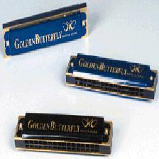
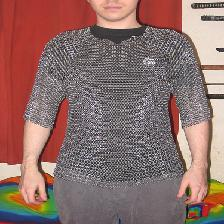

# Major Project

<h3> Title : An integrated Auto Encoder-Block Switching defense approach to prevent adversarial attacks </h3>

 According to the recent studies, the vulnerability of state of the art Neural Networks to adversarial input samples has increased drastically. Neural network is an intermediate path or technique by which a computer learns to perform tasks using Machine learning algorithms. Machine Learning and Artificial Intelligence model has become fundamental aspect of life, such as self-driving cars, smart home devices, so any vulnerability is a significant concern. The smallest input deviations can fool these extremely literal systems and deceive their users as well as administrator into precarious situations. This article proposes a defense algorithm which utilizes the combination of an auto-encoder and block-switching architecture. Auto-coder is intended to remove any perturbations found in input images whereas block switching method is used to make it more robust against White-box attack. Attack is planned using FGSM model, and the subsequent counter-attack by the proposed architecture will take place thereby demonstrating the feasibility and security delivered by the algorithm.

<h2> Dataset :</h2> It is subset of Imagenet Dataset 
<pre>   Source : <a href="https://imagenet.stanford.edu/" >ImageNet </a></pre>

  
  
  

# ML Models Used :
 
<pre>   1. <a href="https://www.tensorflow.org/api_docs/python/tf/keras/applications/resnet">Resnet</a></pre>
<pre>   2. <a href="https://www.tensorflow.org/api_docs/python/tf/keras/applications/MobileNetV2">MobileNetV2</a></pre></pre>
<pre>   3. <a href="https://blog.keras.io/building-autoencoders-in-keras.html">Auto-Encoder</a></pre>
<pre>   4. <a href="https://www.tensorflow.org/api_docs/python/tf/keras/applications/DenseNet121>DenseNet</a></pre>

