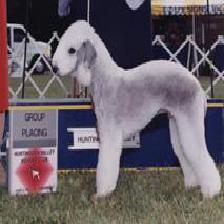
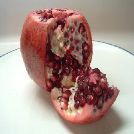
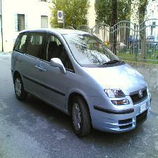
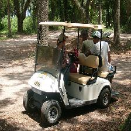
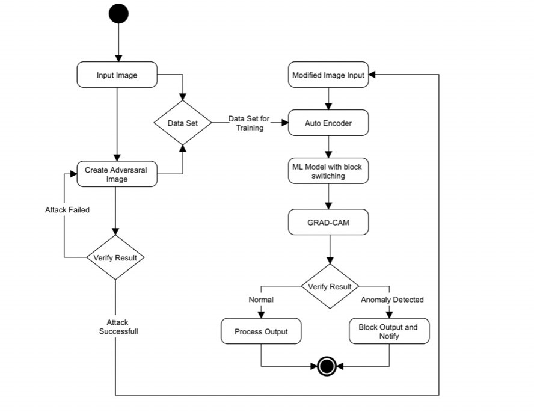

# Adversarial Defense using AutoEncoder, Block Switching & GradCAM


[Architecture](#Architecture)

Table of contents
=================

<!--ts-->
   * [Table of contents](#table-of-contents)
   * [Installation](#installation)
   * [Dataset](#Dataset)
   * [Architecture](#Architecture)
   * [Adversarial Attack](#Attack)
   * [Adversarial Defense](#Defense)
      * [Auto Encoder](#ae)
      * [Grad CAM](#gradcam)
   * [Publication](#Publication)
      * [Auto insert and update TOC](#auto-insert-and-update-toc)
      * [GitHub token](#github-token)
      * [TOC generation with Github Actions](#toc-generation-with-github-actions)
   * [Tests](#tests)
   * [Dependency](#dependency)
   * [Docker](#docker)
     * [Local](#local)
     * [Public](#public)
<!--te-->
The proposed system majorly focuses on static image input and defence architecture. Following are the characteristics of the proposed model: 
<ul><li>Combination of two models to effectively defend both Black box and White Box attack. </li>
      <li>Randomization method acts as a backup for filtration performed by auto-encoder there by increasing the robustness of the proposed model. </li>
      <li>Grad-CAM allows the model to predict the highlighted important region based on classification.</li></ul>


<a name="Dataset"><h2>Dataset :</h2></a><pre>It is subset of Imagenet Dataset
Source : <a href="https://imagenet.stanford.edu/" >ImageNet </a>
           </pre>


<a name="Architecture"><h2>Architecture :</h2></a>
<pre>        </pre>
<h2>ML Models Used :</h2>
<pre>   1. <a href="https://www.tensorflow.org/api_docs/python/tf/keras/applications/resnet">Resnet</a>
   2. <a href="https://www.tensorflow.org/api_docs/python/tf/keras/applications/MobileNetV2">MobileNetV2</a>
   3. <a href="https://blog.keras.io/building-autoencoders-in-keras.html">Auto-Encoder</a>
   4. <a href="https://www.tensorflow.org/api_docs/python/tf/keras/applications/DenseNet121">DenseNet</a></pre>
<a name="Attack"><h2>Adversarial Attack :</h2></a>

1. Fast Gradient Sign Method(FGSM) - [Goodfellow, I. J., Shlens, J., and Szegedy, C. Explaining and harnessing adversarial examples. arXiv preprint arXiv:1412.6572, 2014b.](https://arxiv.org/abs/1412.6572)
```python
   def create_adversarial_pattern(input_image, input_label):
     with tf.GradientTape() as tape:
       tape.watch(input_image)
       prediction = pretrained_model(input_image)
       loss = loss_object(input_label, prediction)
     gradient = tape.gradient(loss, input_image)
     signed_grad = tf.sign(gradient)
     return signed_grad
```
<a name="Defense"><h2>Defense Architecture :</h2></a>
<table>
  <tr>
     <td><pre>Module 1 : Auto Encoder</td></pre>
    <td>Auto-encoders can be used for Noise Filtering purpose. By feeding them noisy data as inputs and clean data as outputs, it’s possible to make them remove noise from the input image. This way, auto-encoders can serve as denoisers.</td>
  </tr>

  <tr>
    <td><pre>Module 2 : Block Switching</td></pre>
    <td>Switching block in this experiment consists of multiple channels. Each regular model is split into a lower part, containing all convolutional layer. lower parts are again combined to form single output providing parallel channels of block switching while the other parts are discarded. These models tend to have similar characteristics in terms of classification accuracy and robustness, yet different model parameters due to random initialization and stochasticity in the training process</td>
  </tr>
  <tr>
    <td><pre>Module 3 : Grad-CAM</td></pre>
    <td>Grad-CAM ( Activation Maps )uses the gradients of any target concept (say logits for “dog” or even a caption), flowing into the final convolutional layer to produce a coarse localization map highlighting the important regions in the image for predicting the concept.”</td>
  </tr>

</table><a name="AE">
  <pre><h3>   Auto Encoder :</h3></a>   Input – Adversarial image
   Output – Clean image after removing noise
   Auto-encoders can be used for filtration purpose.
   It is possible for them to remove adversarial noise from an input image.
  </pre>
  
  <a name="gradcam"> <h3>   Grad CAM :</h3></a>   Input – Gradients of convolutional layer
        Output – Activation/heat map
                  Grad-CAM are activation maps which generate highlights on the classified image to uncover important regions.
              As you can see in the below example gradcam helps us to figure out why the image is predicted as corn instead of dog.
  
  
  
<h3><a name="Publication">Publication</a></h3>
<h3>Title : <a  href="http://gjstx-e.cn/gallery/70-april2021.pdf">An integrated Auto Encoder-Block Switching defense approach to prevent adversarial attacks </a></h3>
<p align="justify"><strong>Abstract :</strong> According to the recent studies, the vulnerability of state of the art Neural Networks to adversarial input samples has increased drastically. Neural network
is an intermediate path or technique by which a computer learns to perform tasks using Machine learning algorithms. Machine Learning and Artificial Intelligence model has become
fundamental aspect of life, such as self-driving cars, smart home devices, so any vulnerability is a significant concern. The smallest input deviations can fool these extremely
literal systems and deceive their users as well as administrator into precarious situations. This article proposes a defense algorithm which utilizes the combination of an auto-
encoder and block-switching architecture. Auto-coder is intended to remove any perturbations found in input images whereas block switching method is used to make it more robust
against White-box attack. Attack is planned using FGSM model, and the subsequent counter-attack by the proposed architecture will take place thereby demonstrating the feasibility
and security delivered by the algorithm.</p>
<h2>Project Organization</h2>

    ├── README.md                         <- The top-level README for developers using this project.
    ├── Resources
    │   ├── AE_output.PNG                 <- Fianl output of Auto-Encoder
    │   ├── Architecture.jpeg             <- Project Architecture
    │   ├── metrics.PNG                   <- Result metric of out final Model
    │   ├── result.PNG                    <- Final Input Output Pipeline
    │   └── gradcam.PNG                   <- Grad-Cam Output
    │
    ├── Dataset                           <- Subset of Imagenet containing more than 200 images belonging to 1000 different classes
    │
    ├── Dataset.zip                       <- Same Dataset Compressed in ZIP file
    │
    ├── Full_Implementation.ipynb         <- Jupyter notebook containing full implementation
    │
    ├── Source_Code.py                    <- Source Code of project as Python Script
    │
    └── reports                           <- Generated analysis as HTML, PDF, LaTeX, etc.
  


--------
